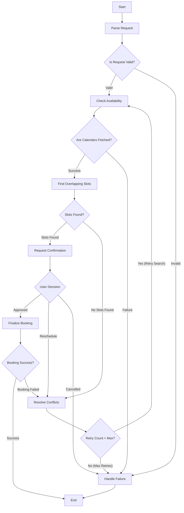

# Multi-Agent Scheduling System - LangGraph State Architecture

This document outlines the state graph representation, state transition matrix, conditional routing logic, and schema definitions for the Multi-Agent Scheduling system.

---

## 1. System Architecture Diagram

The flow of state transformations and routing conditions within the multi-agent graph is visualized below:

---

## 2. State Transition Matrix

The table below lists the node transitions, conditions, and actions within the system:

| Source Node | Trigger/Condition | Target Node | State Modifications & Action Description |
| :--- | :--- | :--- | :--- |
| `__start__` | Entry | `parse_request` | Initializes graph execution. |
| `parse_request` | State contains parser errors | `handle_failure` | Request cannot be parsed or lacks basic requirements (e.g. no participants). |
| `parse_request` | State is valid | `check_availability` | Meeting details successfully parsed into `request` object. Proceed to collect calendar data. |
| `check_availability`| Calendar APIs successfully polled | `find_overlapping_slots` | Populates `availabilities` with participant free/busy lists. |
| `check_availability`| Calendar access fails / Invalid participant | `handle_failure` | Appends error to `errors` array. |
| `find_overlapping_slots`| Overlap block >= duration is found | `request_confirmation` | Selects candidate timeslots, setting `candidate_slots` and default `selected_slot`. |
| `find_overlapping_slots`| No candidate timeslot matches constraints | `resolve_conflicts` | Transition to conflict resolution. |
| `resolve_conflicts` | `retry_count` < `MAX_RETRIES` | `check_availability` | Relaxes meeting window or criteria and increments `retry_count`. Re-check calendar availability. |
| `resolve_conflicts` | `retry_count` >= `MAX_RETRIES` | `handle_failure` | Halts execution to avoid infinite loop. |
| `request_confirmation` | User approves slot (`user_decision == 'approved'`) | `finalize_booking` | User selects or confirms the recommended slot. |
| `request_confirmation` | User requests reschedule (`user_decision == 'reschedule'`) | `resolve_conflicts` | Integrates user-provided new constraints and triggers reschedule flow. |
| `request_confirmation` | User cancels meeting (`user_decision == 'cancelled'`) | `handle_failure` | Discontinues scheduling. |
| `finalize_booking` | Success | `__end__` | The slot is booked, and invites are sent. Workflow completes successfully. |
| `finalize_booking` | Failure (e.g. race condition/double book) | `resolve_conflicts` | Slot became unavailable during confirmation. Re-run conflict resolution. |
| `handle_failure` | Terminal exit | `__end__` | Logs error state and returns final outcome. |

---

## 3. Schema Definitions

### AgentState Schema

The main memory of the scheduling agent contains the following fields:

* `messages`: `Annotated[List[BaseMessage], add_messages]` - Stores natural language communication history between user and agents.
* `request`: `SchedulingMeetingRequest` - Structured metadata parsed from user prompts.
* `availabilities`: `List[ParticipantAvailability]` - Free/busy intervals retrieved for each attendee.
* `candidate_slots`: `List[TimeSlot]` - Mutually available open slots found.
* `selected_slot`: `Optional[TimeSlot]` - The time slot targeted for confirmation and booking.
* `current_stage`: `str` - Tracking variable for the active node stage.
* `user_decision`: `Optional[str]` - Feedback flag from user confirmation step (`approved`, `reschedule`, `cancelled`).
* `conflict_resolution`: `Optional[ConflictResolutionStrategy]` - Stores strategies applied when resolving booking clashes.
* `errors`: `List[str]` - Error messages encountered during execution.
* `retry_count`: `int` - Monotonically increasing counter for conflict resolution attempts.
